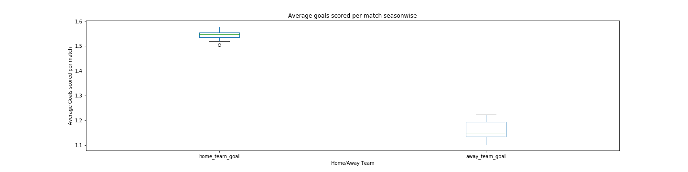

# Explore Dataset - Soccer Data

# Table of Contents

## Project description

In this project, soccer data has been explored and following questions will be answered:

1. Are average goals scored by home teams are higher than the average goals scored by away teams.
2. Is there any home advantage? Are home teams have more victories than away teams?
3. Are average goals scored by home teams are statistically higher than the average goals scored by away teams.

## Environment and Programming language

* Python 2.7.14 has been used.
* Miniconda framework has been used which can be downloaded from this [link](https://repo.continuum.io/miniconda/).
* Once installed, open conda prompt.
* Create virtual environment by using `conda env create -f environment.yaml`. [**environment.yaml**](./environment.yaml) has been included in the repository.
* Jupyter notebook has been used for interactively analyzing and exploring the data.
* Python code and calculation given in the [Notebook file](./project_3_1.ipynb) file.

## Data Description

[Data](./database.sqlite) has been provided as a sqlite file.

## Exploratory Data Analysis

Data file is a **sqlite database file** so we need to first read data from this database file.

### Reading the Data

**sqlite3** library is used to read the data file which itself is a database file. Following steps are involved in reading the data:

1. Open a connection to the sqlite file. Function `sqlite3.connect(filename)` is used for this.
2. Get the list of the tables in the database. Pandas function `pd.read_sql()` is used which takes connection created in step 1 as one of its argument. It was found that there are following 7 different tables in the database:
  * **Player_Attributes**
  * **Player**
  * **Match**
  * **League**
  * **Country**
  * **Team**
  * **Team_Attributes**
3. Function `read_table(table_name)` is used to read the table from the database, returns the pandas dataframe and prints the dimensions and first 5 data points from the table.
4. Finally connection, which was opened in first step, needs to be closed. `conn.close()` is used for this where **conn** is the name of the connection opened.

### Data Exploration

This step consists of exploring the various aspects of the data like missing values, data types, etc.

#### Missing Values

Function `columns_with_without_na(dataframe)` takes the dataframe as input and prints the column with total sum of NA elements and also columns with zero NA elements.

Following is the result of missing values analysis:

**Country Table:**
No missing values found in the table.

**League Table:**
No missing values found in the table.

**Team Table:**
Column **'team_fifa_api_id'** have some missing values but this shouldn't cause any issue because we can use 'team_api_id'.

**Player Table:**
No missing values found in the table.

**Team_Attributes Table:**
Column **'buildUpPlayDribbling'** have lot of missing values. We will analyze this later on.

**Player_Attributes Table:**
Lot of missing values in various columns in this table.

**Match table:**
First 11 columns don't have any missing values and these are the columns which are important to decide win or loose. So we can ignore other columns which have missing values.

#### Checking data types of each columns

Function `datatype(dataframe)` takes dataframe as input and prints the datatype of each column of the dataframe.

This is required because some of the columns may require change of data type like columns containing dates.

### Data Cleaning

We need to filter out the data required to answer the questions for this project.

Most important table is **Match** table which will be used to decide win or loose of the teams. Only first 11 columns are important for that. So, these columns are extracted and saved in new dataframe **match_modified**.

It is better to have country_name, league_name, home_team_name and away_team_name instead of IDs. So we will extract out these values with merge of match_modified table with country, league and team tables and change the names of the respective columns.

* So **match_modified** dataframe is merged with dataframe **country_id** which added one more column in the dataframe. Following code has been used:
```
match_modified_merge = match_modified.merge(country, left_on='country_id', right_on='id',
                                           suffixes= ['', '_country'])
```

* Then merge **match_modified** with **league** table to get league name. Following code has been used:
```
match_modified_merge = match_modified_merge.merge(league, left_on='league_id', right_on='id', suffixes= ['', '_league'])
```

* Then Merge **match_modified** with **team** table to get home_team_name and away_team_name. Following code has been used:
```
match_modified_merge = match_modified_merge.merge(team, left_on='home_team_api_id', right_on='team_api_id', suffixes= ['', '_home'])
```
```
match_modified_merge = match_modified_merge.merge(team, left_on='away_team_api_id', right_on='team_api_id', suffixes= ['', '_away'])
```

* We will take out columns which are required like country_name replacing country_id, team_long_name instead of home_team_api_id, etc. Following code has been used:
```
match_modified_merge = match_modified_merge[['id', 'name', 'name_league', 'season', 'stage', 'date', 'match_api_id', 'team_long_name', 'team_long_name_away', 'home_team_goal', 'away_team_goal']]
```

* We need to change the names of various columns like team_long_name to home_team_name, team_long_name_away to away_team_name, name to country_name and name_league to league_name.
```
match_modified_merge.rename(columns = {'team_long_name':'home_team_name', 'team_long_name_away':'away_team_name', 'name':'country_name', 'name_league':'league_name'}, inplace = True)
```

* We will add a new column for home team win named as home_win which can have three values, that is, 'win', 'loose'and 'draw'. We will compare 'home_team_goal' with 'away_team_goal' which gives us mentioned values.

* We need to change the **date** column in **match_modified_merge** dataframe to date format. Function `change_to_time(element)` is used for this.

* We can see some of the columns like match_api_id and stage should be object variables instead of numerical so we will change datatype of these variable. Also we will change date variable to appropriate datatype. Following code has been used:
```
match_modified_merge['stage']= match_modified_merge['stage'].astype('object')
match_modified_merge['match_api_id']= match_modified_merge['match_api_id'].astype('object')
match_modified_merge['date']= match_modified_merge['date'].apply(change_to_time)
```

* We would like to extract year from the date column as well. Function `extract_year(element)` function is used for this. Further following code is used to extract date and save it to a new column:
```
match_modified_merge['year']= match_modified_merge['date'].apply(extract_year)
```

#### Analysis of missing values in Team_Attributes table

1. Add team name and use team name instead of team ID in Team_Attributes table. Following code has been used:
```
team_attributes_merge = team_attributes.merge(team, left_on='team_api_id', right_on='team_api_id', suffixes=['', '_team'])
```
2. Then filter out the required columns from the **team_attributes_merge** dataframe.
3. Then columns with sum of NA values and columns without any values will be printed using function `columns_with_without_na()` which has already been defined and used previously. It was found that column **buildUpPlayDribbling** is having missing values.
4. Then **groupby** function is used on dataframe with grouping done over **buildUpPlayDribblingClass** column. Following code has been used.
```
team_attributes_merge.groupby('buildUpPlayDribblingClass').count()
```
5. We can clearly see that all the missing values are from the **buildUpPlaySpeedClass == Little** because this class is having less number of counts for **buildUpPlayDribbling** in the dataframe generated by groupby method. So we can fill this value with either mode/median. Lets looks at whether mode/median is very much different mean and replace value accordingly.
6. Then mean and median is calculated on the groupby dataframe and it was found that mean and median is not very different.
7. Then non-missing values for the **buildUpPlayDribblingClass = Little** was checked for any correlation between date and missing values but we are not seeing any relationship.
8. Further missing values in **buildUpPlayDribbling** were filled with median value by using `fillna()` function.

### Visualization

Only **match_modified_merge** dataframe is required to answer the questions asked in this project.

* Histograms were plotted for **home_team_goal** and **away_team_goal**. Following are the histograms:


* We can clearly see that more number of away teams have 0 and 1 goal but less number of away teams have 2, 3, 4, 5 goals and this is opposite to that of home teams.

* We need to group data season wise or stage wise or season and stage wise. So we will use following code to get the required dataframes.
```
goals_mean_season_wise = match_modified_merge.groupby('season').mean()[['home_team_goal', 'away_team_goal']]
```
```
goals_mean_stage_wise = match_modified_merge.groupby('stage').mean()[['home_team_goal', 'away_team_goal']]
```
```
goals_mean_season_stage_wise = match_modified_merge.groupby(['season', 'stage']).mean()[['home_team_goal', 'away_team_goal']]
```

* Then Barplots and boxplots for average goal scored by home team and away team were plotted. Barplots and boxplots has been plotted for every season, every stage and for combined season and stage. Following are the plots:




* We can clearly see almost all of the home team goals are more than away team goals. So this gives us some idea that home advantage is here as per graphics.


* We need to group the dataset with column **home_win** to plot the following graphs. Following code has been used:
```
match_groupby_home_win = match_modified_merge.groupby('home_win').count()['match_api_id']
```
```
match_groupby_home_win_stagewise = match_modified_merge.groupby(['stage', 'home_win']).count()['match_api_id']
```
```
match_groupby_home_win_seasonwise = match_modified_merge.groupby(['season', 'home_win']).count()['match_api_id']
```
* Barplots of count of home team win and away team wins have been plotted in a similar way as we plotted for goals.


* We can clearly see stagewise or seasonwise we have higher numbers of home wins instead of draw or loose.

## Significance Testing

Now we will use statistical methods to find the significance of our conclusion. We will use t-statistics method and will apply it on mean of home team goals and away team goals which are season wise and stage wise. Following are the reasons behind using t-test:

1. We don't have population mean and standard deviation available. So we cant perform z-test on the samples.

2. We have home team goals and away team goals for various stages and seasons. So this is two conditions example in which we are applying two different condition on same sample. So we need to use dependent sample t-test.

### Hypothesis Creation

<a href="https://www.codecogs.com/eqnedit.php?latex=H_0&space;=&space;Null\&space;Hypothesis&space;=&space;\mu_{home}&space;\leq&space;\mu_{away}" target="_blank"></a>

<a href="https://www.codecogs.com/eqnedit.php?latex=H_a&space;=&space;Alternative\&space;Hypothesis&space;=&space;\mu_{home}&space;>&space;\mu_{away}" target="_blank">&space;\mu_{away}" title="H_a = Alternative\ Hypothesis = \mu_{home} > \mu_{away}" /></a>

<a href="https://www.codecogs.com/eqnedit.php?latex=where\&space;\mu_{home}&space;=&space;Home\&space;Team\&space;Score\&space;and\&space;\mu_{away}&space;=&space;Away\&space;Team\&space;Score" target="_blank"></a>

**We will use 95% confidence interval.**

Please refer to the [README.md](https://github.com/shashankvarshney/MLND-Test-a-Perpetual-Phenomenon/blob/master/README.md) file for more details of t-test.

Function `calculation_of_t_stats(dataframe, confidence_interval_in_proportion = 0.95)` is used for calculation of t-stats. This function takes dataframe and confidence  interval as input and returns sample_size, degree_of_freedom, point_estimate, sample_difference_stddev, sample_error, t_stat and t_critical values.

#### Hypothesis parameters Calculations

* **Parameters for goals_mean_stage_wise**
  * Sample size is 38
  * degree of freedom is 37
  * point estimate is 0.385906672824
  * Sample difference standard deviation is 0.0630858922846
  * Sample error is 0.0102338830997
  * t statistics value is 37.7087239579
  * t statistics critical value is 1.68709361671

* **Parameters for goals_mean_season_wise**
  * Sample size is 8
  * degree of freedom is 7
  * point estimate is 0.383942954469
  * Sample difference standard deviation is 0.0380497936509
  * Sample error is 0.0134526335566
  * t statistics value is 28.5403562694
  * t statistics critical value is 1.89457860506

**We can clearly see that both stage wise as well as season wise sample mean of home team goals are statistically higher than the sample mean of the away team goals.**

## Conclusions

### Question 1: Are average goals scored by home teams are higher than the average goals scored by away teams?

**With all the visualizations like histogram, bar plots and box plots, we can clearly see that average goals scored by home teams are higher than the average goals scored by away teams.**

### Question 2: Is there any home advantage? Are home teams have more victories than away teams?

**With all the bar plots created for win/loose/draw, we can clearly see that home teams are having more victories than loses.**

### Question 3: Are average goals scored by home teams are statistically higher than the average goals scored by away teams?

**t-test clearly denotes that alternative hypothesis is true which is sample mean of goals scored by home teams are significantly higher than the sample mean of goals scored by away teams. So there is clear correlation between higher goals scored and home teams but that doesnt clearly signifies that home conditions causes teams to score higher goals. There could be other factors involved like performance of the players which can also contribute to the higher goal counts for home teams.**

## Limitations of the data

I would like to further explore what are various factors which can lead to or contribute in a team's win or loss, team's performances over the years and player's performances over the years but I can see following limitations.

* There is lot of missing data in Match table related to information of players and various other information also. Players are one of the key factors in the result of a match but having lot of missing values don't allow for analysis from players point of view.
* Lot of values are missing in Player_Attributes table which makes it very difficult player's performance.
* Details of various variables (columns) are missing Team_Attributes table. So it is hard to analyze the Team_attributes and ultimately team's performance over the years.
